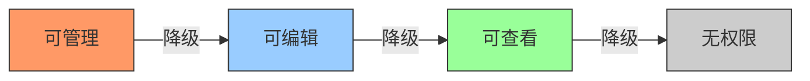
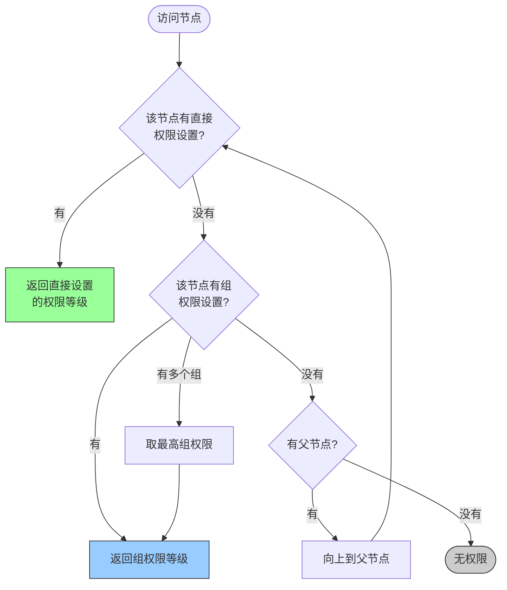
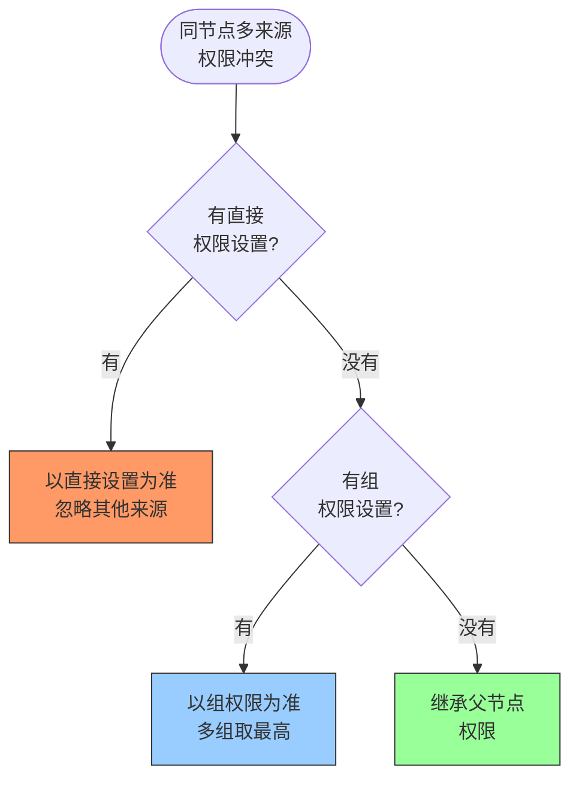
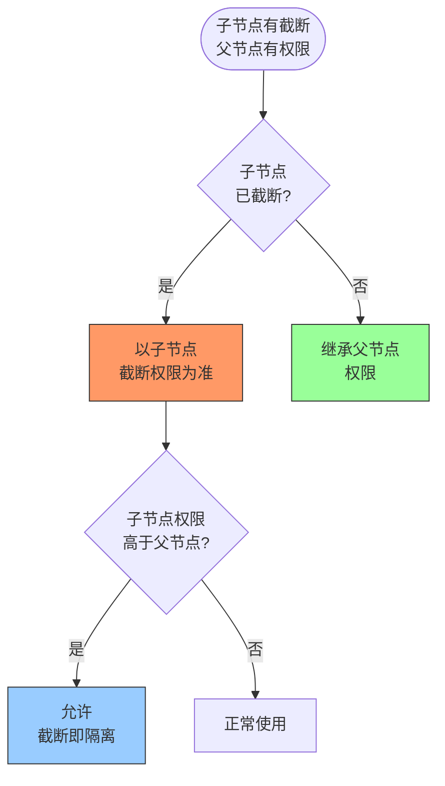
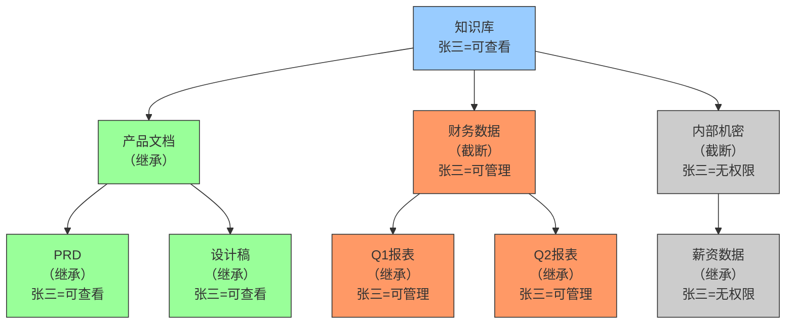

# 在线知识库权限设计方案

## 一、权限等级与操作行为

### 可查看（Reader）

- 浏览文档内容
- 搜索 / 筛选
- 下载 / 导出
- 评论（部分产品允许）

### 可编辑（Editor）

包含可查看的所有操作，加上：

- 创建新文档
- 编辑文档内容
- 上传附件
- 移动 / 归档文档
- 发布 / 撤回发布

### 可管理（Admin）

包含可编辑的所有操作，加上：

- 删除文档
- 创建 / 编辑 / 删除目录结构
- 设置文档权限（谁能看、谁能编）
- 管理成员（邀请 / 移除 / 改权限）
- 管理知识库设置（名称、图标、公开范围）
- 管理回收站（恢复 / 彻底删除）

### 能力矩阵

| 能力 | 可查看 | 可编辑 | 可管理 |
|---|---|---|---|
| 读内容 | ✅ | ✅ | ✅ |
| 改内容 | ❌ | ✅ | ✅ |
| 删内容 | ❌ | ❌ | ✅ |
| 改权限 | ❌ | ❌ | ✅ |
| 管成员 | ❌ | ❌ | ✅ |

## 二、树结构权限模型：继承与截断

### 权限继承（Inheritance）

默认行为：子节点继承父节点的权限。

```
知识库 (Admin: 张三, Editor: 李四)
├── 产品文档 (继承父级)
│   ├── PRD (继承父级)        → 张三=Admin, 李四=Editor
│   └── 设计稿 (继承父级)     → 张三=Admin, 李四=Editor
└── 财务数据 (继承父级)       → 张三=Admin, 李四=Editor ← 不合理
```

### 权限截断（Override / Break）

在某个节点上显式设置权限，打断继承链：

```
知识库 (Admin: 张三, Editor: 李四)
├── 产品文档 (继承)           → 李四=Editor
└── 财务数据 (截断，显式设置)  → 仅张三=Admin，李四无权限
    ├── Q1报表 (继承财务数据)  → 仅张三
    └── Q2报表 (继承财务数据)  → 仅张三
```

截断后，该节点及其子节点以新权限为准，不再向上追溯。

### 截断相关设计决策

**截断粒度**

```
# 粗粒度：整个节点换一套权限
财务数据 → 重置为 {张三: Admin}

# 细粒度：只加减某个人
财务数据 → 移除李四的权限（张三的权限仍继承自父级）
```

**父节点改权限，子节点怎么变**

```
# 场景：在知识库根节点给王五加 Editor 权限
# 财务数据被截断了 → 王五在财务数据下有没有权限？

方案 A：截断完全隔离（推荐）
  → 王五在产品文档下有权限，在财务数据下没有

方案 B：截断只截断新增，不截断已有
  → 王五在所有地方都有权限（因为是从父级继承的新增权限）
  → 这种模型很反直觉，不推荐
```

**截断状态的展示**

```
┌─ 财务数据 ─────────────────┐
│ 权限来源：自定义（非继承）   │  ← 明确告知
│ [恢复继承]                  │  ← 允许撤销截断
│                             │
│ 张三  管理员                 │
│ 李四  已移除                 │
└─────────────────────────────┘
```

### 推荐数据模型

```
permission:
  node_id: "doc_123"
  inherited_from: "doc_parent"   # null = 根节点或已截断
  is_overridden: true/false      # 截断标记
  entries:
    - user_id: "u1"
      role: "admin"
      source: "inherited"        # 来自父级
    - user_id: "u2"
      role: "none"
      source: "override"         # 截断时显式移除
```

## 三、权限冲突解决

### 3.1 同节点同成员权限冲突

用户张三同时通过两条路径获得同一节点的权限时产生冲突。

**冲突来源**

| 冲突类型 | 示例 |
|---|---|
| 直接添加 vs 组成员 | 直接加了可编辑，所在组有可管理 |
| 多个组冲突 | A 组可管理，B 组可查看 |
| 直接添加 + 组 + 父节点继承 | 三条路径都给了不同权限 |

**策略：直接 > 组 > 继承，同层取最高**

```
权限来源优先级：
  1. 直接添加（最高优先）
  2. 组成员
  3. 父节点继承

同优先级内：取最高权限
```

推演示例：

```
张三在「产品文档」节点的权限：
  直接添加：可编辑
  产品组：可管理
  父节点继承：可查看

→ 直接添加优先 → 可编辑（忽略组和继承）
```

```
李四在「产品文档」节点的权限：
  无直接添加
  A组：可管理
  B组：可查看
  父节点继承：可编辑

→ 组优先于继承 → A组可管理 vs B组可查看 → 取最高 → 可管理
```

**为什么不取最低？** 取最低会导致：把某人加到一个"可查看"的组，反而把他的可管理权限降级了，反直觉且危险。

### 3.2 不同层级同成员权限冲突

张三在父节点和子节点有不同权限时，以**最近的显式设置**为准。

```
知识库          → 张三 = 可查看（继承或直接设置）
  └── 财务数据  → 张三 = 可管理（截断设置）
       └── Q1   → 继承自财务数据 → 张三 = 可管理
```

**四种层级冲突组合**

| 父节点 | 子节点 | 结果 | 原因 |
|---|---|---|---|
| 可管理 | 可查看 | 子节点 = 可查看 | 截断降级，以子节点为准 |
| 可查看 | 可管理 | 子节点 = 可管理 | 截断升级，以子节点为准 |
| 可查看 | 截断移除 | 子节点 = 无权限 | 截断显式拒绝 |
| 可管理 | 未截断 | 子节点 = 可管理 | 继承，复制父级权限 |

**子节点能否升级？**

方案 A：截断完全自由（推荐）
- 子节点可以设任意权限，与父节点无关
- 截断是显式操作，说明管理员有意为之
- 现实场景：知识库级别给人只读，但某个子目录让他负责编辑
- Notion、飞书文档都这么做

方案 B：子节点权限不能超过父节点
- 防止低权限节点管理员越权提升
- 但会导致「为什么我加了可管理却不生效」的困惑
- Confluence 的空间权限有类似限制

### 3.3 完整判定流程

用户访问某节点时，权限计算步骤：

```
1. 该节点有该用户的直接权限设置？
   → 有，取直接设置的权限

2. 该节点有该用户所在组的权限设置？
   → 有，取最高组权限

3. 以上都没有？→ 向上找父节点，重复 1 和 2
   → 命中，继承该权限

4. 找到根节点都没有？
   → 无权限
```

推演示例：

```
产品文档 节点：
  直接设置：张三 = 可编辑  ← 命中，结束，返回可编辑

财务数据 节点：
  无直接设置
  无组设置
  → 向上找
  知识库根：
    直接设置：张三 = 可查看  ← 命中，返回可查看

内部机密 节点：
  直接设置：张三 = 无权限（截断显式拒绝） ← 命中，返回无权限
```

## 四、流程图

### 4.1 权限等级



### 4.2 单节点权限判定



### 4.3 同节点冲突解决



### 4.4 不同层级冲突解决



### 4.5 树结构完整示例


